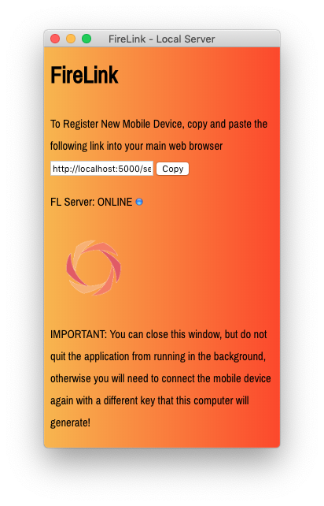
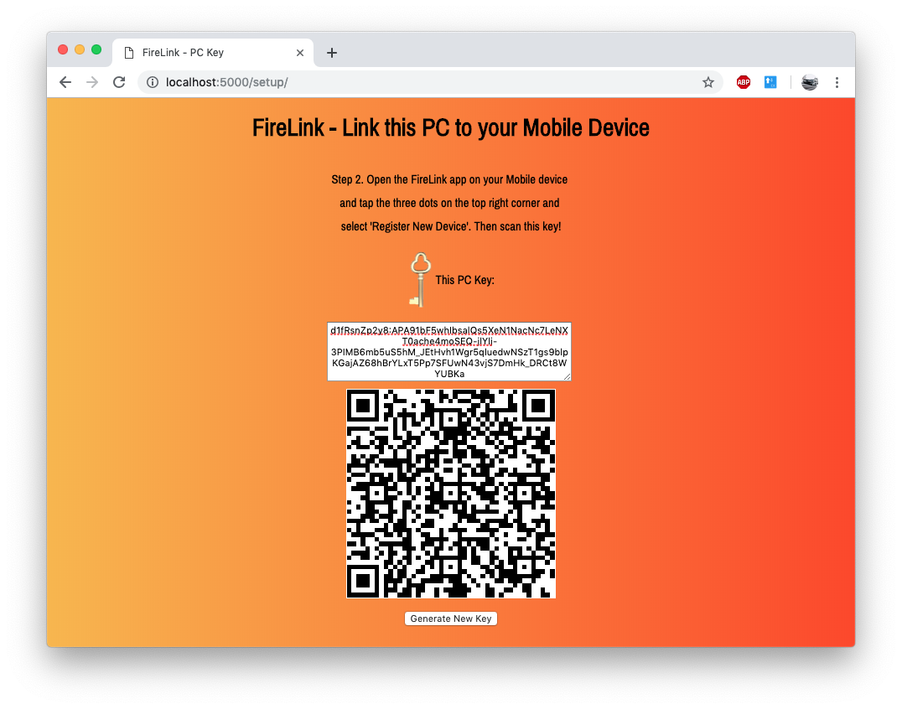

# FireLink-WinMac
FireLink Desktop Software for Mac, Windows and Linux!

**Preview Demo**

Step 1. Run the setup
:-------------------------:

Step 2. Copy and paste the link and you'll end up on this page if all goes well.
:-------------------------:

Step 3. Open the FireLink app on your mobile device and select the three dots in
the top right corner and select **Register New Device** and then scan the QR Code 
(for security purposes, it is recommended to first generate a new key everytime 
you connect a new device). Now accept the friend request and enjoy the tool! You 
can now close the FireLink softwareon your computer, but do not quit it from running
in the background. The rest is self explanatory for a developer, but if you're stuck, 
go to <a href="https://github.com/bartektenDev/FireLink/blob/master/README.md#firelink-">FireLink</a>
